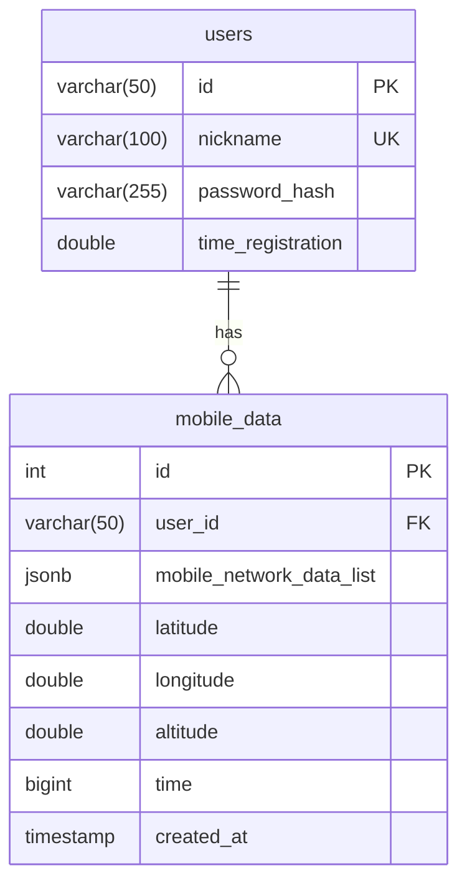

# Android Project Backend

## Ссылки на репозитории

- Android приложение: [https://github.com/Emeteil/android-learning](https://github.com/Emeteil/android-learning)
- C++ desktop приложение: [https://github.com/Emeteil/andlean_cpp_frontend](https://github.com/Emeteil/andlean_cpp_frontend)

## Описание

Cерверная часть для мобильного приложения на Android. Изначально сервер был написан на **Flask** по шаблону **flask_template**.

[https://github.com/Emeteil/flask_template](https://github.com/Emeteil/flask_template)

Но после был переписан на **FastAPI** с использованием нового шаблона **fastapi_template**, для повышения производительности, улучшения типизации и документации.

[https://github.com/Emeteil/fastapi_template](https://github.com/Emeteil/fastapi_template)

## Основные возможности

### REST API
- **Маршруты:** Все API эндпоинты сгруппированы в директории `api/`.
- **Валидация:** Строгая проверка входных данных через Pydantic.

### WebSocket
- **Эндпоинт:** `/api/mobile-network/ws`
- **Функционал:** Авторизованные пользователи могут отправлять данные о мобильной сети в реальном времени. Эти данные сохраняются в БД и мгновенно рассылаются всем подключенным "анонимным" клиентам.

### Авторизация
- **Токены:** Поддержка передачи токена через Cookie (`token`), заголовок `Authorization: Bearer <token>`, параметры запроса или JSON тело.
- **Защита:** Использование зависимостей FastAPI (`Depends`) для контроля доступа к эндпоинтам.
- **Сессии:** Возможность проверки статуса входа (`is_logged`) как для HTTP, так и для WebSocket соединений.

## Базы данных (PostgreSQL)

### 1. Mermaid


### 2. Безопасность (Защита от SQL-инъекций)
Все SQL запросы в коде используют параметризованные выражения psycopg2 (принцип передачи параметров через `%s`). Гарантия отсутствия инъекций.

### 3. Настройка конфигурации подключения
1. Базовые настройки подключения (host, port, db_name, user) лежат открыто в `settings.yml` (блок `database`).
2. В блоке `environment_variables` в `settings.yml` прописан ключ `"db_password"`.
3. Сам пароль задается исключительно локально в файле `.env`: `db_password="пароль"`

### 4. Запросы

**Создание таблиц**
```sql
CREATE TABLE IF NOT EXISTS users (
    id VARCHAR(50) PRIMARY KEY,
    nickname VARCHAR(100) UNIQUE NOT NULL,
    password_hash VARCHAR(255) NOT NULL,
    time_registration DOUBLE PRECISION NOT NULL
);

CREATE TABLE IF NOT EXISTS mobile_data (
    id SERIAL PRIMARY KEY,
    user_id VARCHAR(50) REFERENCES users(id) ON DELETE CASCADE,
    mobile_network_data_list JSONB,
    latitude DOUBLE PRECISION,
    longitude DOUBLE PRECISION,
    altitude DOUBLE PRECISION,
    time BIGINT,
    created_at TIMESTAMP DEFAULT CURRENT_TIMESTAMP
);

CREATE INDEX IF NOT EXISTS idx_mobile_data_user_time ON mobile_data(user_id, time DESC NULLS LAST);

CREATE INDEX IF NOT EXISTS idx_mobile_data_user_id ON mobile_data(user_id);
```

**Вставка пользователя:**
```sql
INSERT INTO users (id, nickname, password_hash, time_registration) 
VALUES (%s, %s, %s, %s)
```

**Получение данных сети по пользователю:**
```sql
SELECT mobile_network_data_list, latitude, longitude, altitude, time 
FROM mobile_data 
WHERE user_id = %s 
ORDER BY time DESC NULLS LAST 
LIMIT %s OFFSET %s
```

**Вставка данных:**
```sql
INSERT INTO mobile_data (
    user_id, mobile_network_data_list, latitude, longitude, altitude, time
) VALUES (%s, %s, %s, %s, %s, %s)
```

## Документация

Интерактивная документация API: [http://94.159.111.243:5678/docs](http://94.159.111.243:5678/docs)

## Сервер

- Ссылка 1: [http://94.159.111.243:5678](http://94.159.111.243:5678)
- Ссылка 2: [http://friendsshield.duckdns.org:5678](http://friendsshield.duckdns.org:5678)